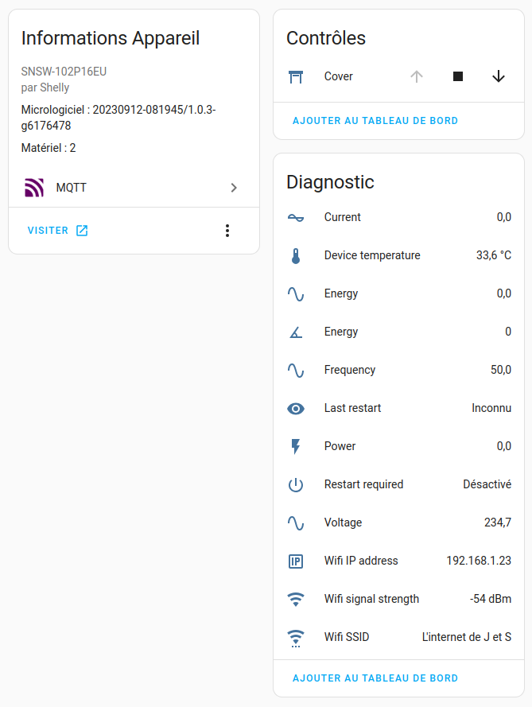

# Shelly time based cover

This is a script to use a time-based calibration as a workaround for roller shutters unsupported by Shelly devices.

It publishes its state over MQTT alongside HA MQTT autodiscovery entities.

## The issue

Some Bubendorff roller shutters are wired with 4 cables:
- phase
- neutral
- command up
- command down

Unfortunately it seems the commands are not used to power directly the motor and Shelly positioning feature relies on the motor power consumption to guess wether or not the cover is moving.

## The workaround

This script uses "max close time" and "max open time" configuration as calibration parameter to compute a "virtual position".

On startup, the device virtual position is always `unknown`.  
The virtual position is initialized when the roller shutter is opened of closed completely for the first time, after the "max close time" or "max open time" timeout has expired.  
Then each time the cover is moving the virtual position is updated step by step. One step is 5% of the "max close time" or "max open time".

## Configuration

Virtual position is calibrated using 85% of "max close time" and "max open time" to let some error margin to avoid releasing relays too soon.

Assuming I have a roller shutter taking 20s to close and 25s to open, I use the following configuration :
- max close time: 25s
- max open time: 30s,

This way, given the roller shutter is fully opened,  
when I close it,  
then the position is moving to 0% after ~21s  
and the relay is released 4s after by the shelly timeout.

